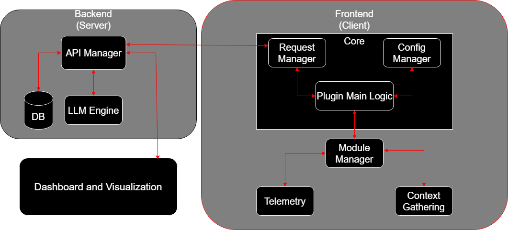
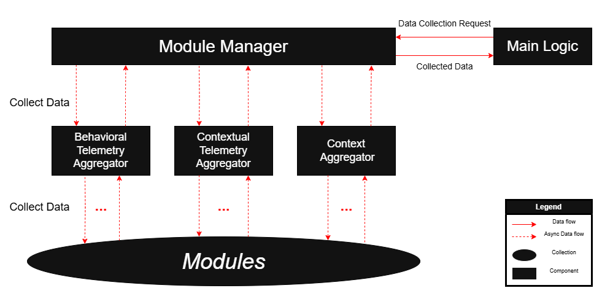
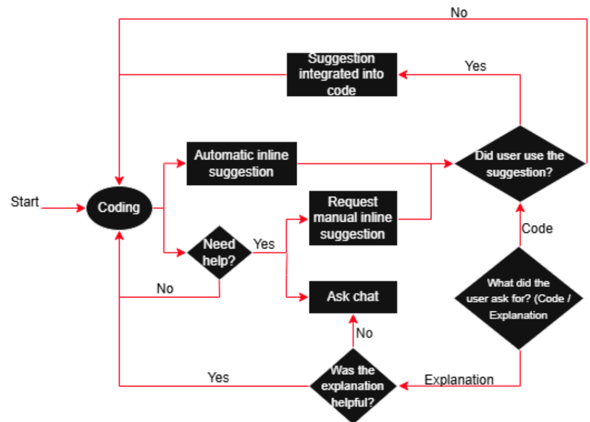

# Code4Me V2 - IntelliJ Plugin

[](https://github.com/AISE-TUDelft/code4me2)
[](https://plugins.jetbrains.com/docs/intellij/build-number-ranges.html)
[](https://kotlinlang.org/)
<!-- Plugin description -->
An intelligent code completion and chat assistant plugin for IntelliJ-based IDEs, powered by capable AI models. Code4Me V2 enhances your development workflow with context-aware completions and conversational programming assistance through a sophisticated modular architecture.
<!-- Plugin description end -->
## 🎯 Project Overview

Code4Me V2 is an AI-powered code completion platform developed for the **AISE laboratory at TU Delft**. The IntelliJ plugin serves as the primary interface for researchers and developers, providing real-time AI-assisted coding with comprehensive telemetry collection for academic research.

**Note**: All AI models, server configurations, and module settings are configurable through the `plugin.conf` file, allowing researchers to customize the system for different experiments and deployments.

### Core Features

#### Code Completion
- **AI-Powered Suggestions**: Get intelligent code completions based on your current context
- **Multiple Display Modes**: Choose between inline suggestions (default) or traditional dropdown completions
- **Multi-Model Support**: Choose from multiple AI models (configured in plugin.conf)
- **Context-Aware**: Leverages file content, cursor position, and project structure for relevant suggestions
- **Real-time Generation**: Fast completion suggestions with minimal latency

#### Chat Assistant
- **Conversational Programming**: Interactive chat interface for code discussion and assistance
- **Multi-File Context**: Understands your entire project context across selected files
- **Code Analysis**: Get explanations, refactoring suggestions, and debugging help
- **Session Management**: Persistent chat history with project-specific conversations

#### Comprehensive Settings Management
- **Complete User Control**: Enable/disable individual modules through intuitive settings interface
- **Granular Data Collection**: Choose exactly what data is collected and transmitted
- **Privacy Controls**: Comprehensive settings for data collection with transparent controls
- **Limited Data Collection Mode**: One-click configuration for minimal data sharing
- **Module-Based Preferences**: Individual control over telemetry, context, and behavioral modules
- **Dependency Management**: Automatic handling of module dependencies when enabling/disabling

## 🚀 Getting Started

### Installation
1. **Download**: Get the plugin from the JetBrains Plugin Repository (coming soon) or build from source
2. **Install**: Install through IntelliJ IDEA's plugin manager or manually install the `.jar` file
3. **Restart**: Restart your IDE to activate the plugin

### First-Time Setup
After installation, you'll need to create an account to use Code4Me's AI-powered features:

1. **Open Settings**: Navigate to `Settings > Tools > Code4Me V2 Settings`
2. **Create Account**:
   - Toggle to "Sign Up Mode"
   - Enter your full name, email, and password
   - Review and accept the privacy policy and terms
   - Click "Sign Up" to create your account
3. **Alternative - Login**: If you already have an account, simply enter your email and password in Login Mode

### Initial Configuration
Once authenticated, you can customize your experience:

1. **Choose Your Privacy Level**:
   - Click "Use Limited Data Collection" for minimal data sharing
   - Or configure individual modules for granular control

2. **Select AI Models and Completion Mode**:
   - Access model preferences through the module tree
   - Choose from available models (see plugin.conf for current model list)
   - Toggle between inline completions (default) or dropdown completions

3. **Configure Data Collection**:
   - Enable/disable completion data storage
   - Control contextual and behavioral telemetry
   - Customize individual module preferences

### Start Using Code4Me
With setup complete, you can immediately begin using:

- **Code Completions**: Start typing in any supported language to receive AI-powered suggestions. Choose between inline suggestions (shown directly in your editor) or traditional dropdown completions through the settings
- **Chat Assistant**: Open the Code4Me chat panel (located on the right sidebar) to ask questions and get programming help
- **Context-Aware Features**: The plugin automatically gathers context from your project to provide relevant assistance

The plugin works out-of-the-box with minimal configuration, but offers extensive customization options through the comprehensive settings interface.

## 🏗️ System Architecture

### High-Level Architecture Overview



### User Flow Architecture

## ⚡ Module System Architecture

The Code4Me plugin is built around a sophisticated modular architecture that provides exceptional flexibility, extensibility, and user control over functionality and data collection.

### Modular Design Principles

```
Configuration Layer:
├── plugin.conf (HOCON Configuration)
└── ConfigService (Dynamic Module Loading)
    │
    ▼
Core Interface:
├── PluginModule Interface (Data Collection Contract)
├── PreferenceCapable (Settings Management)
└── Record System (Type-safe Data Storage)
    │
    ▼
Module Categories:
├── Behavioral Telemetry (Typing, Timing, Acceptance)
├── Contextual Telemetry (Editor, File, Position)
├── Context Retrieval (File, Multi-file, Project)
├── Model Configuration (AI Models, Preferences)
├── Aggregators (Data Coordination)
└── After Insertion (Feedback, Ground Truth)
```

### Module Lifecycle Management

The module system follows a sophisticated lifecycle that ensures proper initialization, dependency resolution, and data collection:

**1. Configuration Loading Phase**
- Modules are defined in plugin.conf with hierarchical structure
- Each module specifies its class, dependencies, and submodules
- Configuration supports both hard and soft dependencies
- Enabled/disabled state is configurable per module

**2. Dynamic Module Instantiation**
- ConfigService uses reflection to instantiate module classes
- Modules are loaded based on their dependency order
- Failed module loading doesn't crash the entire system
- Module instances are cached for performance

**3. Dependency Resolution**
- System builds dependency chains and validates relationships
- Hard dependencies must be satisfied for module operation
- Soft dependencies are optional enhancements
- Circular dependencies are detected and prevented

### Module Categories & Implementation

#### Behavioral Telemetry Modules
Track user interaction patterns and typing behavior:

- `TimeSinceLastShownCompletion` - Tracks intervals between completion requests
- `TimeSinceLastAcceptedCompletion` - Measures acceptance timing patterns
- `TypingSpeed` - Calculates characters per second for adaptive debouncing

#### Contextual Telemetry Modules
Gather environment and editor state information:

- `EditorContextRetrievalModule` - Collects editor state, file language, cursor position

#### Context Retrieval Modules
Collect code context from various sources:

- `FileContextRetrievalModule` - Current file content and path
- `MultiFileContextRetrievalModule` - Context from all open editor sessions and project-wide references and relationships

#### Aggregator Modules
Coordinate data collection from multiple submodules:

- `BaseBehavioralTelemetryAggregator` - Coordinates behavioral data collection
- `BaseContextualTelemetryAggregator` - Manages contextual information gathering
- `BaseContextAggregator` - Handles context retrieval coordination
- `BaseAfterInsertionAggregator` - Manages post-completion actions

### Record System & Data Aggregation

The plugin uses a type-safe record system for data collection and aggregation:

```kotlin
data class Record(
    val type: Type,
    internal val expanded: MutableMap<EntryKey, Any> = mutableMapOf()
) {
    enum class Type {
        CONTEXT,
        BEHAVIORAL_TELEMETRY,
        CONTEXTUAL_TELEMETRY,
        MODEL
    }
    
    companion object {
        inline fun <reified T : Any> key(name: String): EntryKey {
            return EntryKey(name, T::class.java)
        }
    }
}

// Usage example - type-safe data storage
val record = Record(Record.Type.BEHAVIORAL_TELEMETRY)
record.put(Record.key<Long>("timing_data"), 1500L)
record.put(Record.key<String>("event_type"), "completion_shown")
```

**Data Aggregation Process:**
```kotlin
fun aggregateByType(): Map<Record.Type, List<Record>> {
    return this.groupBy { it.type }
}

fun toMap(): Map<String, Any> {
    return this.expanded.entries.associate { (key, value) ->
        key.name to value
    }
}
```

## 🔌 Client-Server Communication

### Authentication & Session Management

```
IntelliJ Plugin
      │
      ▼ User Login Request
Authentication Service
      │
      ▼ OAuth Flow (optional)
Google OAuth ──► JWT Token ──► Authentication Service
      │                              │
      ▼                              ▼
Code4Me Backend ◄── POST /api/user/authenticate
      │
      ▼ Session Tokens
Authentication Service ──► Authentication Success ──► IntelliJ Plugin

Authenticated Communication Flow:
Plugin ──► API Requests with Session Cookies ──► Backend
       ◄── Responses with Token Refresh ────────── Backend
```

### API Communication Patterns

The plugin communicates with the Code4Me backend through a comprehensive REST API with the following characteristics:

**Base Configuration:**
- Server settings loaded from plugin.conf (host, port, timeout)
- Specialized HTTP clients for different operations (chat, completion, authentication)
- Automatic retry logic with exponential backoff
- Connection pooling for improved performance

#### Request/Response Flow

**Completion Request Process:**
1. **Data Collection Phase** - ModuleManager collects data from all enabled modules
2. **Data Aggregation** - Records are grouped by type and converted to maps
3. **API Request Construction** - Request object built with context, telemetry, and user preferences
4. **Server Communication** - HTTP request sent to completion API with authentication
5. **Response Processing** - Completion results integrated back into IDE interface

### Error Handling & Resilience

**Authentication Error Recovery:**
- Automatic detection of invalid or expired tokens
- Graceful fallback to login prompt when authentication fails
- User data cleanup on authentication errors
- Clear notification system for token invalidation

**API Communication Resilience:**
- Automatic token refresh on 401 responses
- Connection retry logic with exponential backoff
- Graceful degradation when backend is unavailable
- Local caching of critical configuration data
- User notification system for connection issues

### Privacy Controls & Data Management

**User Preference System:**
The plugin provides comprehensive privacy controls through the PrefSettings system:
- **Code Context Storage** - Enable/disable storage of file content and snippets
- **Environment Telemetry** - Control collection of editor state and file information
- **User Behavior Analytics** - Manage collection of typing patterns and interaction data
- **Active Module List** - Maintain list of enabled/disabled modules
- **Module Preferences** - Individual settings for each module's behavior

**Limited Data Collection Mode:**
- One-click button applies privacy-focused defaults across all modules
- Disables non-essential data collection while maintaining core functionality
- Provides transparent indication of what settings were changed
- Reversible - users can re-enable specific modules after applying limited mode

### Data Transmission Control

**What Gets Sent to Server:**
- **Code Context**: File content snippets, cursor position, selection (if enabled)
- **Contextual Telemetry**: File paths, language info, editor state (if enabled)
- **Behavioral Telemetry**: Typing patterns, completion acceptance rates (if enabled)
- **Chat Data**: Conversation history for context continuity
- **Feedback Data**: Completion acceptance/rejection for model improvement

**Privacy Safeguards:**
The plugin implements comprehensive data filtering before transmission:
- Context data is filtered based on storeContext preference
- Telemetry data is filtered based on respective telemetry preferences
- Users have granular control over what data leaves their local environment

## ⚙️ Configuration Management

### HOCON Configuration System

The plugin uses HOCON (Human-Optimized Config Object Notation) for configuration management. The configuration includes:

**Server Configuration** (customizable for different backend deployments):
- Backend server host and port settings
- Connection timeout and retry parameters
- Context path and SSL configuration

**Authentication Settings** (customizable OAuth configuration):
- Google OAuth client credentials
- Session timeout and renewal settings
- Multi-provider authentication support

**AI Model Configuration** (example models shown - researchers can configure any models):
- Available model definitions with IDs and names
- Chat vs completion model classification
- Default model selection and system prompts
- Custom model parameters and settings

**Module Categories Definition** (researchers can add custom categories):
- Behavioral telemetry modules for user interaction patterns
- Contextual telemetry modules for environment and editor state
- Context retrieval modules for code understanding
- Aggregator modules for data coordination
- Model modules for AI configuration
- After-insertion modules for post-completion actions

**Note**: The specific models and settings shown in plugin.conf are examples from the current configuration. Researchers can modify plugin.conf to use different models, change system prompts, and adjust all settings for their specific experiments.

### Module Configuration Examples

**Complete Module Definition Structure:**
Each module in plugin.conf includes:
- **Identification** - Unique ID, class name, and display name
- **Type Classification** - Module type (aggregator, telemetry, context, etc.)
- **Description** - Human-readable description of module function
- **Enablement State** - Whether module is active by default
- **Submodules** - Nested modules with their own configurations
- **Dependencies** - Hard and soft dependencies on other modules

**Dependency Types:**
- **Soft Dependencies** - Module works without them but with reduced capabilities
- **Hard Dependencies** - Required for basic module operation
- **Dependency Validation** - System prevents circular dependencies and ensures required modules are available

### Runtime Configuration Management

**Dynamic Configuration Loading:**
- HOCON format allows comments, includes, and variable substitution
- Configuration is parsed and validated during plugin startup
- Module configurations are processed hierarchically

## 🔧 Performance Optimization

### Module System Performance

**Parallel Data Collection:**
- Enabled modules process data collection requests in parallel streams
- Failed modules don't block other modules from completing
- Exception handling ensures individual module failures don't crash the system
- Stream-based processing provides efficient resource utilization

**Asynchronous Processing:**
- Non-blocking completion requests with configurable timeouts
- Cancellable operations that respect IDE responsiveness
- Background processing for non-critical operations
- Efficient thread pool management for concurrent requests

### Communication Optimization

**Connection Pooling:**
- HTTP client reuse with connection pooling
- Persistent connections for chat operations
- Connection recovery and retry logic

**Caching Strategies:**
- Local caching of completion results
- Context data caching to avoid redundant collection
- Configuration caching to reduce startup time

## 🛠️ Development Setup

### Prerequisites
- JDK 21 or higher
- IntelliJ IDEA 2024.2+
- Gradle 8.13+

### Building the Plugin
```bash
# Clone the repository
git clone https://github.com/AISE-TUDelft/code4me2.git
cd code4me2

# Build the plugin
./gradlew build

# Run tests
./gradlew check

# Run in development IDE
./gradlew runIde
```

### Code Quality Standards
The project maintains high code quality through:
- **Kotlin Code Style**: Enforced through ktlint
- **Automated Testing**: JUnit-based test suite
- **Static Analysis**: Gradle Qodana plugin for code quality analysis
- **Documentation**: Dokka for comprehensive API documentation


## Adding New Modules

**1. Implement PluginModule Interface:**
Create a new module class that implements the PluginModule interface with:
- Module name and identification
- Data collection logic in collectData method
- Preference class specification (BEHAVIORAL_TELEMETRY, CONTEXTUAL_TELEMETRY, etc.)
- Preference list definition with keys, types, and descriptions

**2. Add to plugin.conf:**
Register your module in the configuration with:
- Unique module ID and class name
- Module type and description
- Enabled/disabled state
- Dependencies and submodules if applicable
- Register with an Aggregator

### Code Quality Requirements

- **Documentation**: Comprehensive KDoc for all public APIs
- **Error Handling**: Graceful degradation and proper logging
- **Performance**: No blocking operations on UI thread
- **Security**: No sensitive data in logs or debug output

## 📚 API Reference

### Core Plugin APIs

#### ModuleManager
Key interface for module lifecycle management:
- `getAvailableModules()` - Returns list of all available modules
- `collectData(request)` - Triggers data collection from all enabled modules
- `initializeModules()` - Initializes modules and their dependencies
- `storeModules(modules)` - Stores module instances for runtime use

#### ConfigService
Configuration management and module instantiation:
- `getAvailableModules()` - Gets module configurations from plugin.conf
- `getServerConfig()` - Returns server connection settings
- `getModelsConfiguration()` - Returns AI model configuration
- `instantiateModulesFromConfigs()` - Creates module instances from configuration


### REST API Integration

The plugin integrates with the Code4Me backend through these endpoints:

**Authentication:**
- `POST /api/user/authenticate/` - User login
- `POST /api/user/create/` - Account creation
- `GET /api/user/get/` - Current user info

**Completion:**
- `POST /api/completion/request/` - Request code completion
- `POST /api/completion/feedback/` - Submit completion feedback
- `POST /api/completion/multi-file-context/update/` - Update context

**Chat:**
- `POST /api/chat/request/` - Chat completion request

## 📚 Resources

- [IntelliJ Platform SDK](https://plugins.jetbrains.com/docs/intellij/welcome.html) – Plugin development reference
- [Gradle IntelliJ Plugin](https://github.com/JetBrains/gradle-intellij-plugin) – Build & run IntelliJ plugins
- [Kotlin Docs](https://kotlinlang.org/docs/home.html) – Language and standard library
- [HOCON Spec](https://github.com/lightbend/config#using-hocon-the-json-superset) – Plugin configuration format
- [ktlint](https://github.com/pinterest/ktlint) – Kotlin linter
- [OAuth 2.0](https://oauth.net/2/) – Authentication standard
- [TU Delft AISE Lab](https://malihehizadi.github.io/aise/) – Research group behind Code4Me
## 🙏 Acknowledgments

- **TU Delft AISE Laboratory** for research support and academic collaboration
- **JetBrains** for the IntelliJ Platform and development tools
- **Hugging Face** for AI model infrastructure and ecosystem
- **Kotlin Community** for the excellent programming language and ecosystem

