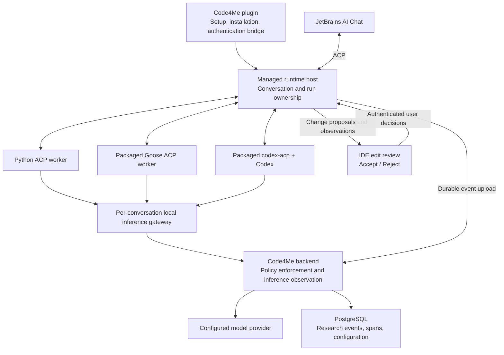

# Managed Python, Codex, and Goose agents with comparable research telemetry

Updated **2026-09-12** from the original plan, after reviewing plugin **`9186d1a`** and server **`959397f`**. The architecture and overall intent are retained; completed foundations and remaining issues are updated. These are the same code revisions checked in the preceding review; the newly supplied original document contains older implementation assumptions.

Read sections **1–6** for the objective, architecture, research design, and features; **7–8** for interfaces and release expectations; **9** for separately assignable implementation issues. `P/` means `code4me2/`; `S/` means `code4me2-server/`.

## 1. Objective and agreed boundaries

Deliver one participant plugin ZIP containing all three agents for macOS ARM64, macOS x64, Windows x64, and Linux x64. Participants should need only the plugin, JetBrains AI Assistant, and their Code4Me login.

The researcher controls which agents and configurations participants may use. Configuration must reflect each runtime’s actual controls:

- Python: enforce the controls implemented in the custom runtime.
- Goose: apply the supported native settings and the inference tool filter.
- Codex: apply supported native settings; its native tools remain outside Code4Me’s tool-selection controls.
- Record requested settings, effective settings, enforcement mechanisms, and unsupported capabilities separately.

Support controlled and native-agent study designs. Controlled studies match settings that are actually controllable across their selected agents; the system must not imply identical tool behavior.

The deliverable is structured, documented, reliable data in PostgreSQL. New analysis dashboards, statistical testing, benchmark scoring, and research reports are outside scope. GitHub becomes the authoritative CI system.

### What V2 changes at a high level

V2 is the next version of Code4Me's agent integration and data contracts. It builds on the streamlined Python agent and the existing plugin/backend. The main change is that Python, Codex, and Goose become three supported choices within the same managed participant experience.

For participants, this means one installation and login, an assigned agent that starts without developer setup, responsive output, reliable cancellation, and a clear way to review and accept or reject edits. The existing engines keep their own reasoning loops and tools.

For researchers, this means being able to say which configuration actually ran, which actions were observed, what users decided, and where information was unavailable. The same measurement must mean the same thing across agents; different native capabilities must remain visible. A stopped run is not a successful task, and an agent-written file is not an accepted edit.

The work therefore has five connected parts: **finish three-agent distribution; protect study conditions; collect comparable, durable telemetry; add essential interaction features including Accept/Reject; and certify the result through CI**. The issues at the end implement these parts without rebuilding foundations that already work.

### Findings that drive the design

The main change since the original plan is server `959397f`: study-scoped assignments, task attribution/protection, separate observed settings, event constraints, and admin controls. Its 17 changed files include no tests/CI changes. Plugin `aa170a6`/`9186d1a` add development preparation/registration fallback. Keep the recent MCP legacy-mode, email-failure and environment-file fixes.

| Area | Already implemented | Remaining work |
|---|---|---|
| Participant setup | Python installer/repair, auth bridge, registration, policy checks | Extend to all engines; restrict development fallback |
| Goose/Codex | Developer integrations, native relay and Codex adapter | Complete pinned components, explicit launch paths, four-platform certification |
| Study conditions | Study/user assignment; task study/profile/arm/consent snapshots and protection | Eligibility/revocation, immutable revisions, frozen provider routing and conversation condition |
| Event integrity | Conflict-safe assignment creation, unique event identities and atomic indexes | Correct receive timestamps/conflicting retries; canonical spans and cross-batch correlation |
| Admin/data | Arm/baseline selectors, study assignment screens, profile retirement, saved study IDs used in existing evaluation | Capability/revision UX and tests; retain history and correct outcome/count meanings |
| Runtime/telemetry | Tools, permissions, MCP, memory/resume, basic cancellation and self-reporting | Streaming/Responses, blocking cancellation, explicit outcomes and durable capture/upload |
| Edit review | `AgentEdit`, decision helpers and native permission prompts | User-facing Accept/Reject, safe application/reversal, and decision telemetry |
| Packaging/CI | Python native-build and participant ZIP workflows | All three engines; remove release placeholders; required full-stack checks |

**Confirmed corrections:** duplicate-safe event inserts can save NULL receive timestamps; clearing a used assignment conflicts with snapshot protection; multiple active studies can cross attribution. PostgreSQL probes reproduced these. Concurrent assignment creation and event deduplication passed: retain those mechanisms. Provider settings remain mutable, participant setup can enter development fallback, and the website CI build fails on existing lint warnings. These are addressed before relying on the affected paths for a study.

### Validation baseline

Previously run at these revisions: Python **20 tests + 5 subtests**, managed backend **14 tests**, plugin **235 unit + 69 integration tests** passed; generated-client reports had **241 passes** reused as up-to-date. Isolated PostgreSQL probes checked the latest migration/concurrency, not the full migration history. Website CI-mode build failed on existing lint warnings (I21).

This update rechecked source, migrations, UI/configuration, runtimes, packaging and workflows. This document edit changed no product code and did not rerun those suites. Full backend regression, hosted required checks, complete migration-chain and native platform certification remain release work.

## 2. Architecture

The architecture extends the working Python onboarding path instead of maintaining three separate launch and telemetry systems. The plugin handles installation and the user's IDE context; a managed host connects that experience to the assigned native engine; the backend owns study policy and durable research records.

### Shared managed host, existing agent engines

Keep the existing agent implementations. Add a small managed host responsible for authentication, process lifecycle, policy translation, ACP observation, and telemetry delivery.



The host does not perform reasoning or replace the native agent loops.

### Ownership and lifecycle rules

1. **Conversation:** one ACP chat history, bound to one user, project, study assignment, profile revision, and runtime.
2. **Run:** one `session/prompt` and all work performed before its terminal response.
3. **Model call:** one logical inference operation; retries are separate attempts.
4. **Tool execution:** one native tool-call identifier and its lifecycle.
5. **Maintenance run:** explicitly scoped initialization, resume, or other runtime work that invokes a model outside a user prompt.

Create a separate worker process and loopback gateway for each ACP conversation. Allow one active prompt per conversation and concurrent prompts in different conversations.

This prevents an inference request from needing to guess its project or run. Each gateway has immutable conversation ownership and an explicit active run.

The host must:

- Translate ACP request identifiers between the IDE connection and worker connections.
- Preserve opaque native session, message, and tool identifiers.
- Forward cancellation and permission requests.
- Reject unauthorized model, mode, or configuration changes.
- Supervise complete process trees, including native child processes.
- Persist the mapping needed to resume the same engine’s conversation.
- Never silently substitute a different engine.

Use the existing grant and authentication bridge. Backend credentials remain with the host. Workers receive only a random credential accepted by their local gateway.

### Runtime implementations

| Engine | Packaged execution |
|---|---|
| Python | Existing executable in an internal ACP worker mode. |
| Goose | Pinned native executable launched with `goose acp`. |
| Codex | Compiled `codex-acp` executable launching an explicitly bundled native Codex executable through `CODEX_PATH`. |

Retain the Codex adapter’s existing app-server integration. Official Codex documentation exposes structured thread, turn, item, plan, command, edit, and usage events; use those surfaces instead of parsing terminal output. Generate protocol types from the pinned Codex version. [Codex App Server documentation](https://learn.chatgpt.com/docs/app-server)

Goose officially supports ACP over subprocess stdio, making it suitable for the same host boundary. [Goose ACP documentation](https://goose-docs.ai/docs/gdk/acp/)

### Repository ownership

Keep two repositories. The server owns host/runtime packaging; the plugin owns IDE integration. Retain the authoritative Codex adapter at `P/dev/codex-acp-proxy/codex-acp/` initially and build it from an explicitly pinned plugin commit. Preserve its license, provenance, lockfile, and tests. Moving it into the server repository is only justified if packaging or ownership requires it; it is no longer a prerequisite. Apply the same rule to Python module splits: refactor only around a needed implementation/test boundary.

## 3. Configuration and experimental attribution

The new study assignments and task snapshots answer part of “which condition was this participant given?” The remaining work makes that condition stable for the whole conversation and records what was actually enforced. An administrator editing a profile later must not change an existing run's provider or make its historical settings ambiguous.

### Versioned capability contract

Add a runtime capability catalogue describing each configurable field:

```text
RuntimeCapability:
  runtime_id
  runtime_version
  adapter_version
  capability_schema_version
  controls:
    field
    value_schema
    support: enforced | native_config | relay_filter | observable_only | unsupported
    enforcement_location
    limitations
  observations:
    event_family
    availability
    timing_source
```

`native_config` means Code4Me configures a documented native setting. It must not imply that Code4Me independently enforces every operation affected by that setting.

The admin API and UI must consume this catalogue. Remove duplicated hardcoded runtime-control assumptions from the website.

### Configuration structure

Create immutable `AgentProfileRevision` records with:

| Group | Fields |
|---|---|
| Identity | Profile ID, revision, runtime ID, certified runtime release |
| Provider | Provider configuration revision, model, API protocol |
| Common limits | Maximum logical model calls, maximum provider attempts, wall-clock limit |
| Model options | Supported sampling, reasoning, output-limit settings |
| Python options | Tool allowlist, command policy, approval policy, context strategy, iteration limit |
| Goose options | Native execution mode, supported context settings, advertised-tool filter |
| Codex options | Supported native mode, approval/sandbox settings, reasoning settings |
| Features | Supported planning/history/context options and permitted MCP configuration |
| Research | Telemetry schema, content policy, comparison-design label |

Do not accept arbitrary native configuration blobs. Use a discriminated schema keyed by runtime, with explicitly supported fields.

### Initial control matrix

| Control | Python | Goose | Codex |
|---|---|---|---|
| Provider/model routing | Backend controlled | Backend controlled | Backend controlled for certified Responses-compatible providers |
| Per-tool selection | Runtime enforced | Filter advertised inference tools | Unsupported |
| Command allowlist | Runtime enforced | No equivalent guarantee from filtering | Unsupported as a Code4Me control |
| Approval behavior | Custom policies | Native Goose modes | Native Codex policies |
| Context management | Custom implementation | Supported native controls | Only supported native controls |
| Model-call/attempt limits | Backend admission gate | Backend admission gate | Backend admission gate |
| Wall-clock stopping | Host supervision | Host supervision | Host supervision |
| Native tool observations | Direct instrumentation | ACP observations | ACP/app-server observations |

For Goose, describe filtering accurately: it changes tools advertised to inference and is not an OS sandbox. Preserve both advertised and filtered tool inventories.

For Codex, omit the tool-selection input entirely. An empty Codex tool catalogue must never be interpreted as “tools disabled.”

Unsupported requested controls must produce a field-specific validation error. Never silently ignore them.

### Study and assignment rules

- Extend the new `agent_study_assignment` table rather than building another assignment system. Keep the old global assignment table only for legacy compatibility.
- Support `admin_assigned` and explicitly selected `randomized` modes in the initial release; default new studies to `admin_assigned`. Record source, allocation algorithm/version, and probabilities for randomized assignments.
- Persist explicit eligibility/enrollment, validate dates and active arms, and allocate transactionally once per participant/study.
- Retain assignment identity/history and use audited revocation instead of destructive Clear/re-roll. A later reassignment/crossover requires a new explicit history-preserving design.
- For initial delivery, enforce the existing **single active study per server** rule and one active agent-study enrollment per participant. The original broader goal of concurrent studies with different participants, participant choice within an allowed set, and advanced allocation remains a **nice-to-have follow-up (I28)**, requiring explicit study selection rather than pooled active arms.
- Never fall back to unrelated active profiles when an enrolled study has no eligible configuration. Non-study operational use must be explicit.
- Freeze the assignment and effective profile revision for an entire conversation. Normal changes apply to new conversations; revocation terminates authorization for affected work.
- Do not carry history across a runtime or study-arm change automatically.
- Include edit-review mode and decision unit in the condition. Controlled comparisons must match supported review behavior; native-agent studies may differ only with the difference recorded.

Each run stores an immutable configuration receipt containing:

```text
study_id, enrollment_id, assignment_id, assignment_source
profile_id, profile_revision, comparison_design
runtime_id, runtime_version, adapter_version, host_version
requested_configuration, effective_configuration
capability_snapshot, enforcement_snapshot
provider_configuration_revision, configuration_hash
```

Secrets are excluded. Credential rotation may retain the same secret reference; changing provider routing creates a new configuration revision.

## 4. Research telemetry contract and database design

The objective is comparable evidence, not simply more event rows. Backend observations tell us what model requests were made; runtime/ACP observations tell us about tools, permissions, edits, and failures. Their shared contract preserves the source and limits of each measurement so researchers can compare like with like and identify what was not observable.

### Standards baseline

Align the schema with OpenTelemetry GenAI conventions for agent operations, model calls, tool executions, usage, and durations. These conventions remain under development and have moved to a dedicated repository. Pin a verified conventions revision and mapping during I06 rather than following `main` automatically or carrying forward an unverified reference-plan pin. [OpenTelemetry migration notice](https://opentelemetry.io/docs/specs/semconv/gen-ai/), [GenAI conventions](https://github.com/open-telemetry/semantic-conventions-genai)

Use ACP’s explicit prompt, tool, permission, plan, and usage events for the common observation layer. Capability negotiation determines what is available. [ACP prompt lifecycle](https://agentclientprotocol.com/protocol/v1/prompt-turn)

No external observability service or collector is required for this delivery. Store the data and the versioned OpenTelemetry mapping in the repository.

### Canonical identifiers and envelope

Introduce `code4me.agent.event.v2`:

```text
schema_version
event_id                         UUID, identical on retries
event_kind
producer_id                      unique process/producer instance
producer_sequence                monotonically increasing within producer
occurred_at                      UTC timestamp
observed_at                      UTC timestamp
conversation_id
run_id
trace_id                         32 hexadecimal characters
span_id                          16 hexadecimal characters, when applicable
parent_span_id                   16 hexadecimal characters, when applicable
native_identifiers               typed runtime identifiers
attributes                       validated by event_kind
content_references
measurement_provenance
```

Server-derived ownership and study attribution must not be accepted from client-supplied identifiers.

Use monotonic clocks for durations. Do not subtract timestamps from different machines to calculate latency.

Maintain separate event and span identifiers. Native UUIDs or opaque ACP IDs must not be forced into OpenTelemetry span identifiers.

### Required event families

| Family | Required observations |
|---|---|
| Lifecycle | Startup, initialization, conversation creation/load/close, run start/end, cancellation, timeout, process exit, crash recovery |
| Configuration | Assigned revision, effective settings, capabilities, configuration changes rejected, observed policy deviations |
| Model | Logical request, attempts, requested/effective/reported model, protocol, streaming state, finish reason, errors |
| Usage | Input/output tokens, cached input, cache writes, reasoning tokens, provider-reported cost when available |
| Timing | Queue delay, provider operation duration, first response chunk, first user-visible output, cancellation latency |
| Tools | Native name/ID, normalized category, lifecycle, status, error category, argument/result sizes, truncation |
| Permissions | Requested decision, available options, selected result, automatic/manual origin, waiting duration |
| Context | Message/tool-definition counts and sizes, context limits, estimates, truncation/compaction events, instruction fingerprints |
| Plans | Explicit plan revisions and step states when emitted |
| Edits and decisions | Proposal/revision ID, file/change identity, proposed/applied/reverted state, explicit user accept/reject/undecided decision, review mode, decision time/source, apply/revert outcome |
| Validation | Actual command exit status and structured test results when available |
| Delivery | Retries, acknowledged batches, queue pressure, sequence gaps, dropped content/events, incomplete observations |

Preserve native names alongside normalized categories such as `read`, `search`, `edit`, `execute`, `mcp`, `delegate`, and `other`.

Capture exposed reasoning summaries only when the runtime supplies them and content consent permits storage. Their absence is not an instrumentation failure.

### Measurement rules

Every optional measurement must distinguish:

```text
source:
  backend_measured | acp_observed | runtime_reported | estimated

missing_reason:
  unsupported | not_emitted | redacted | not_applicable
  interrupted | delivery_lost
```

Apply these rules consistently:

- Provider-reported usage is authoritative for backend inference records.
- Runtime usage observations may supplement or corroborate it; they must not be added twice.
- Cached and reasoning token counts are subsets of their corresponding totals, not additional tokens. [GenAI usage conventions](https://github.com/open-telemetry/semantic-conventions-genai/blob/main/docs/gen-ai/gen-ai-spans.md)
- Store token estimates in separate fields with estimator name/version.
- Preserve zero as zero and missing as null.
- Record cumulative native usage as cumulative; derive deltas only when a reliable previous observation exists.
- Keep first-chunk latency distinct from first-token latency.
- Store ACP-observed tool duration separately from a native reported execution duration.
- Remove the practice of dividing inter-model-call gaps across tools.
- A completed agent turn does not establish task correctness.
- A file write or permission approval does not establish human acceptance.
- A missing edit decision remains unknown.
- Native features that cannot be observed remain explicitly unavailable.
- Record inference calls, provider attempts, tool executions, and event rows as separate counts.
- Do not sum parallel spans to obtain wall-clock duration.

### Database layout

Keep existing tables and historical rows. The current migration head is **`f3c4d5e6f7a9`**, which already adds study assignments, task attribution/protection, observed fields, and event constraints. Add the following through successor migrations, preserving those foundations:

| Table/change | Purpose |
|---|---|
| `agent_profile_revision` | Immutable, validated configuration and capability requirements |
| `agent_study_enrollment` | Explicit participant membership and active study scope |
| Extended `agent_study_assignment` | Preserve the new study/user identity and arm/source fields; add retained revocation/history and immutable revision/allocation metadata |
| `agent_conversation` | ACP/native session mapping and frozen assignment/configuration |
| Extended `agent_task` | One v2 run per prompt or maintenance operation; explicit terminal status and configuration receipt |
| `agent_span` | Operation tree, links, timestamps, status, measurement provenance, typed attributes |
| Extended `agent_event` | Immutable v2 event envelope and validated JSONB attributes |
| `agent_artifact` | Consent-gated redacted content referenced by events/spans |
| Extended `agent_edit` and decision records | Immutable proposal revisions, run/tool linkage, user decision identity/provenance, review mode, and separate application/reversal status |
| `agent_ingest_batch` | Durable acknowledgement, duplicate detection, and delivery accounting |

`agent_span` is an idempotent projection of canonical events, updated transactionally during ingestion. Model and tool attributes are validated typed structures stored as JSONB; frequently filtered identity, operation, status, and timing fields are ordinary columns.

Add plain SQL projection views for model calls, tools, permissions, edits, and configuration receipts. These are researcher access surfaces, not reports.

Required constraints:

- Unique `event_id`.
- Unique `(producer_id, producer_sequence)`.
- Unique `(trace_id, span_id)`.
- Foreign keys tying runs and conversations to their assignment/profile revisions.
- Transactional run creation and assignment allocation.
- Indexed run/event time, study/assignment, conversation, and native correlation identifiers.
- Retain the new atomic `next_event_index` allocator and `(task_id, event_index)` / source-identity uniqueness. Index gaps are allowed; they are not agent steps. Fix insert defaults and compare duplicate contents rather than introducing another allocator.

Retain old span columns and legacy event fields during compatibility support. New records use the explicit v2 identifiers; do not reinterpret historical UUID relationships as valid OpenTelemetry IDs.

### Terminal states

Use:

```text
completed
cancelled
failed
timed_out
budget_exhausted
interrupted
```

Store the native stop reason and terminal cause separately.

Late telemetry may complete a span or improve usage information. It must not reopen a terminal run or convert cancellation into completion. Edit review may happen after a run ends: save that user decision and its application result separately without changing the run outcome.

## 5. Capture, inference, privacy, and delivery

Collection must remain reliable when the network drops, an agent crashes, or consent changes. The host records permitted observations durably; the backend acknowledges only committed data and links related events even if they arrive later or out of order. Content protection applies before local persistence as well as on upload.

### Backend inference

Create one v2 inference service used by all engines:

- Explicit `api_kind`: `chat_completions` or `responses`.
- Streaming and non-streaming support.
- Backend-owned model-call observations.
- Separate logical request and attempt IDs.
- Policy checks before provider admission.
- Transactional model-call and attempt limits.
- Cancellation propagated to the upstream connection.
- Incremental SSE parsing with bounded buffers.
- Provider usage preserved on success, error, incomplete response, or disconnect when available.

Do not infer the API protocol from whether the body contains `input`.

Codex must use a certified Responses-compatible provider combination. Remove blanket normalization that silently discards native reasoning or tool semantics. Provider-specific compatibility handling is permitted only as an explicit adapter with contract tests and a recorded adapter version.

For retries:

- Retry explicitly retryable failures before response output starts.
- Honor `Retry-After`.
- Record each attempt.
- Do not transparently replay a partially delivered stream.
- Do not automatically repeat an ambiguous inference POST after an authentication failure.
- Maintain a request ledger so duplicate admission is detected; return an explicit in-progress/ambiguous result when replay is unsafe.

### Runtime observations

The host observes common ACP traffic for all three engines.

Python additionally emits detailed internal events through the host’s authenticated local telemetry endpoint. Those events enrich common observations without creating duplicate model calls or tool executions.

The Codex adapter forwards useful native app-server metadata through a namespaced extension consumed by the host. Keep this extension small: native IDs, usage, plan, edit, command, compaction, and child-agent observations.

Goose observations use its emitted ACP tool, status, and usage events. Do not patch its reasoning loop to manufacture unavailable internals.

Correlate tools with model calls only where identifiers establish the relationship. Otherwise preserve an unresolved link and its reason.

### Durable uploader

Replace the in-memory uploader with a SQLite WAL queue in the IDE application-data directory.

Defaults:

- Flush every second, at 50 events, or on terminal lifecycle events.
- Maximum HTTP batch: 250 events or 1 MiB.
- Maximum queued data: 100 MiB per authenticated account/backend scope.
- Retention: seven days.
- Retry with exponential backoff and jitter, capped at 60 seconds.
- On shutdown, allow two seconds for upload; retain unacknowledged records.
- Acknowledgements occur only after the backend transaction commits.

Queue limits must produce explicit loss accounting. Reserve queue capacity for lifecycle and delivery-loss records; discard content artifacts before structural records.

Ingestion must accept out-of-order batches and duplicates. Correlation cannot depend on two related events sharing a batch.

Backend database unavailability must return a retryable failure. Do not log and swallow successful-looking telemetry writes.

### Content consent

Use one typed content policy on both the host and backend:

- Separate metadata from prompts, responses, arguments, tool output, diffs, free-text errors, and paths.
- Redact credentials before either local queueing or upload.
- Store content only when both capture-time policy and current server consent allow it.
- Consent granted later must not authorize previously unconsented content.
- Revocation strips pending content while preserving eligible structural records.
- Unknown extension fields must not enter metadata storage automatically.
- Record redaction-policy version and content truncation explicitly.

Use a study-scoped HMAC identifier for paths without content consent. Raw absolute paths and arbitrary tool titles are content.

Operational conversation history is separate from research telemetry. Store new managed histories in owner-restricted local application data, with a 30-day default retention and deletion support. Do not use research-content tables as the engine’s operational memory store.

Retain existing server-side memory only for legacy compatibility; exclude it from the researcher read role.

## 6. Agent features and participant experience

The participant experience should be consistent even though the engines have different internals: start the assigned agent, see work progress, stop it reliably, understand changes, and decide whether to keep them. The existing Python tools, permission flow, memory/resume, and MCP support are the starting point.

**Necessary** features below are part of the release. **Nice-to-have** features remain in the design and telemetry schema but may follow later; do not fabricate observations for an unsupported feature. A study that specifically requires an optional capability must promote it to an activation prerequisite.

| Feature | What needs to be done | Telemetry | Importance / issues |
|---|---|---|---|
| Three-agent setup | Extend Python onboarding to bundled Goose/Codex, shared repair and truthful readiness. | Runtime/component versions, startup/repair result | Necessary — I11, I13, I14, I19, I20 |
| Streaming | Add streaming to managed inference and Python output; execute only complete valid tool arguments. | First chunk/visible output, completion/interruption | Necessary — I10, I12 |
| Reliable cancellation | Interrupt inference, permission waits, commands/MCP and process trees; enforce bounded shutdown. | Requested/acknowledged cancel, latency, remaining operations | Necessary — I09, I11, I12 |
| Robust context and tools | Preserve tool-call/result groups, bounded output and valid memory; return explicit denied/failed/timed-out results. | Context limits/overflow, error class, operation status | Necessary — I12 |
| **Accept/Reject edit review** | Present diffs, record explicit decisions, and safely apply or reverse the specific reviewed change. | Proposal/revision, accept/reject/undecided, review mode, apply/revert result | **Necessary — I18, I29** |
| Actual validation results | Capture real command execution and recognizable test outcomes; retain unknown results. | Exit/signal/timeout, test method/counts when known | Necessary — I18 |
| MCP lifecycle | Preserve the recent legacy-client fix; validate startup/discovery/calls/cleanup with an actual toy server. | Availability, failures, permissions, tool spans | Necessary — I12, I15 |
| Durable collection | Persist and independently retry observations and user decisions after outages/restarts. | Queue age/retries, acknowledgements, explicit loss | Necessary — I17 |
| Structured plans | Add explicit Python plan updates and normalize emitted native plans, without forced extra reasoning calls. | Plan revisions and step states | Nice to have — I25 |
| Complete Python history replay | Persist/replay client-visible ACP history and advertise `session/load` only when complete. Existing memory/resume remains. | Load source/duration/replay/failure | Nice to have — I26 |
| Rich context/compaction detail | Add deeper context-source and compaction observations where supported. | Before/after counts, units, cause, provenance | Nice to have — I27 |
| Advanced study modes | Add participant choice, weighted allocation, crossovers or concurrent studies only for an explicit study need. | Selection source, probabilities, retained history | Nice to have — I28 |

### Accept/Reject means a user decision, not a tool permission

The database already has edit-decision fields and helpers, but that does not deliver the feature. Implement a project-scoped review interface with a diff and **Accept/Reject for each file's change**. Closing the view leaves the decision undecided. The UI/data issues are separate so different owners can build them against the same contract.

Use pre-apply review when the engine exposes a complete proposal: Accept permits applying it and Reject prevents it. Some native paths write directly; for these, take a baseline before the run and make post-apply review explicit: Accept keeps the change, while Reject reverses only that recorded change after checking for intervening user edits. Conflicts require renewed review; never restore the whole repository or overwrite unrelated work. Post-apply rejection does not reverse command side effects. Record the review mode so unlike workflows are not silently compared as identical conditions.

Keep user decision and application status separate: a user can accept an edit whose application then fails. Authenticated plugin decisions, proposal revisions, timestamps, and actual outcomes feed the same durable telemetry path; native agent self-reports cannot manufacture human acceptance. Local review content is operational, while research storage of diffs/content remains consent-gated.

ACP plan updates replace the complete plan state; use that behavior when implementing I25. [ACP plan specification](https://agentclientprotocol.com/protocol/v1/agent-plan)

Keep observation coverage explicit for native shell edits. Do not add a new Python subagent scheduler, computer use, or multimodal execution in this delivery; retain supported native observations without claiming every engine has those features.

## 7. Public interfaces and compatibility

Add:

| Interface | Purpose |
|---|---|
| `GET /api/acp/v2/capabilities` | Protocol, telemetry, runtime, and schema compatibility |
| `GET /api/acp/v2/readiness` | Authorized study/profile/runtime and launch requirements |
| `POST /api/acp/v2/conversations` | Create or resume a scoped conversation |
| `POST /api/acp/v2/runs` | Idempotently create a run and immutable policy receipt |
| `POST /api/acp/v2/inference` | Explicit-protocol model request with run/request/attempt identifiers |
| `POST /api/acp/v2/runs/{run_id}/finish` | Idempotent terminal transition |
| `POST /api/agent/v2/events/ingest` | Typed batch ingestion and durable acknowledgement |
| `GET /api/agent/v2/runtime-capabilities` | Admin configuration catalogue |
| `POST /api/agent/v2/edits/{edit_id}/decisions` | Authenticated plugin decision, proposal revision, idempotent decision ID, and separate application outcome |
| Extended profile/enrollment/assignment APIs | Immutable revisions, researcher control, retained assignment history and revocation |

Use the existing grant exchange and session refresh mechanisms with explicit v2 protocol negotiation.

Update:

- `S/openapi.json`
- `P/src/main/resources/backend/api/openapi.json`
- Generated client output through the repository’s generator.

Keep v1 endpoints operational for one migration release. Store v1 observations as legacy data without inventing missing detail. New participant builds use only v2.

Capability readiness should validate supported schema capabilities and migration ancestry rather than require equality with one exact Alembic revision.

## 8. Test and release gates

### Required suites

| Suite | Scenarios |
|---|---|
| Contract | Every runtime/profile variant, event family, provenance value, unsupported setting, malformed payload |
| Runtime host | Concurrent conversations/projects, request-ID collisions, permissions, cancellation, crashes, EOF, logout, mode changes |
| Inference | Chat/Responses, streaming/non-streaming, split SSE frames, usage-only frames, tool-only output, retries, disconnects, budgets |
| Telemetry | Cross-batch correlation, reordered events, duplicate delivery, conflicting duplicate IDs, late completion, missing start/end |
| Consent | Consent off/on/revoked, nested content, credential fields, paths, native errors, queued artifacts |
| Database | Fresh migration, upgrade, concurrent writes, idempotency, assignment history, foreign-key scope |
| Native adapters | Real packaged executables with a deterministic local provider and isolated workspace |
| Plugin | Installation, executable permissions, checksums, repair, registry preservation, multiple windows, setup status |
| Admin UI | Runtime-specific controls, immutable revisions, assignment/revocation, timezone/error handling, unsupported study settings |
| Edit review | All three engines: proposals, accept/reject/undecided, pre/post-apply modes, user-edit conflicts, failed apply/revert, offline replay, ownership |
| Regression | Existing backend, plugin, generated-client, website, and integration suites |

Use genuine PostgreSQL and Redis services for backend integration tests. Mock provider responses, not database transactions or the entire application import graph.

Create reusable synthetic traces for all three agents representing the same observable sequence:

```text
prompt → model → permission → tool → model → final response
```

Assert equal canonical meanings where observations exist. Assert explicit missingness where a native runtime does not expose a field.

Include a final-tool-without-another-model-call case; telemetry must not depend on the next inference request. Also include edit decisions after run completion and a failed apply/revert: neither can rewrite the terminal run state or be counted as a successful application.

### Coverage and CI rules

- Require 90% line and 85% branch coverage for new owned policy, lifecycle, gateway, ingestion, and uploader code.
- Exclude generated and vendored code from owned-code thresholds; run their appropriate suites separately.
- Replace placeholder tests in touched behavior paths with observable assertions.
- Run plugin integration tests explicitly.
- Pin build tools and dependencies; key caches by OS, architecture, runtime, and lockfile hashes.
- Publish JUnit, coverage, contract-diff, and native-certification artifacts.
- Default checks require no paid model access.
- Optional live-provider smoke tests do not replace deterministic release certification.

### Release acceptance

All necessary issues must meet acceptance. Optional features are only gates for study profiles that require them. A release is eligible only when:

1. All three engines launch from each of the four platform bundles.
2. No participant Python, Node, npm, Goose, Codex, source checkout, or provider key is required.
3. The installed runtime obeys its assigned supported configuration.
4. Unsupported controls are rejected before study activation.
5. Every observed run has explicit study/configuration attribution.
6. Model usage and tool observations are not duplicated or silently estimated.
7. Offline/retried delivery preserves structural records or records explicit loss.
8. Consent-off operation does not store research content.
9. Final signed/notarized artifacts pass native extraction and startup checks.
10. Required GitHub checks pass for the pinned server/plugin combination, including real database, website and plugin integration checks.
11. Accept/Reject works in the certified mode for each engine, records explicit user decisions and real application outcomes, and preserves intervening user work.

Roll out the backend schema and compatibility layer first, then certify the new plugin, then enable v2 study profiles. Rollback uses the previous certified plugin/backend-compatible release; it must never switch a participant to another agent silently.

## 9. Implementation issues and parallel delivery

The design above is the reference for the issues below. Each issue names the user/research outcome, implementation files, dependencies, and completion checks. IDs are retained from the review so existing references remain usable. I29 is the explicit Accept/Reject feature; I18 implements its data/API side.

| Priority | Meaning |
|---|---|
| **P0 — Necessary, urgent** | Correct a current data/execution/validation gap before relying on the affected path in a study. |
| **P1 — Necessary for release** | Deliver the three-agent experience and research guarantees described above. |
| **P2 — Nice to have** | Follow-on capability; promote only when a study explicitly requires it. |

**Workstreams:** study/configuration (I02–I04, I08); contracts/storage/telemetry (I01, I06–I07, I15–I18); host/inference/Python (I09–I12); Goose and Codex separately (I13/I14); plugin/review (I05, I19, I29); CI/packaging/release (I20–I24). The optional work is I25–I28. Roles can be combined for a smaller team.

Paths follow the `P/` and `S/` repository prefixes above. Files introduced with **add** are proposed. Dependencies are merge/acceptance dependencies: owners may begin against agreed schemas/fixtures before all implementations merge. These are plan issues, not published issue-tracker entries.

### I01 — Fix event persistence

**P0 · Backend/data · Depends: none**

**Summary:** reliable timestamps and retries protect the collected data.

**Files:** S `src/database/crud.py`, `src/agents/{event_writer,ingest}.py`; add `tests/database_tests/test_agent_event_integrity.py`.

**Implement:** Fix Core insert defaults; retain atomic indexes/uniqueness and allow index gaps. Detect conflicting duplicate contents. Add read-only historical duplicate/NULL preflight; never invent timestamps.

**Done when:** PostgreSQL tests cover timestamps, concurrent retries, conflicting duplicates, rollback, and non-destructive preflight.

### I02 — Preserve assignment history

**P0 · Backend/data · Depends: none**

**Summary:** revoking access must not erase the participant’s assigned condition.

**Files:** S `src/database/{db_schemas,crud}.py`, `src/agents/registry.py`, `src/backend/routers/agent/profiles.py`, ACP authorization guards; add migration and retention tests.

**Implement:** Replace destructive Clear/Delete with audited, idempotent revocation. Keep arm/source/task references immutable; revoked users cannot re-randomize by restarting. Give the old route an intentional compatibility response.

**Done when:** used/unused assignments retain history, revoked users cannot restart into another arm, and expected conflicts return intentional API errors.

### I03 — Make study allocation trustworthy

**P0 · Study backend · Depends: none**

**Summary:** participants must receive an eligible arm from exactly the intended study.

**Files:** S `src/agents/registry.py`, `src/database/{db_schemas,crud}.py`, `src/backend/routers/analytics/studies.py`; add participation/activation migration and tests.

**Implement:** Enforce single-active-study activation transactionally; query arms by the resolved study. Validate membership, dates and certified profiles. Default new studies to admin assignment; explicitly record random allocation source, algorithm and probabilities. Invalid study traffic fails closed.

**Done when:** concurrent activation, mixed-study arms, expired/ineligible/revoked users, and empty arms cannot produce crossed or fallback attribution.

### I04 — Freeze full execution settings

**P0 · Policy backend · Depends: I06**

**Summary:** editing a profile must not change an ongoing experiment.

**Files:** S `src/database/{db_schemas,crud}.py`, profile/ACP/legacy-agent routers; add `src/agents/policy.py`, profile-revision migration and tests.

**Implement:** Build immutable revisions/receipts from section 3. Pin provider route/API/credential reference; infer nothing from mutable profile names. Permit secret-value rotation and preserve unknown historical conditions.

**Done when:** profile edit/rename/retirement and study deactivation cannot alter existing runs; new conversations use the intended revision; secrets never enter receipts.

### I05 — Correct participant readiness

**P0 · Plugin · Depends: none**

**Summary:** ordinary participants must never be told a development fallback is a working installation.

**Files:** P `src/main/kotlin/me/code4me/services/agent/ParticipantAgentSetupService.kt`, preparation action and startup activity; add setup-service tests.

**Implement:** Gate local discovery and legacy handoff on explicit development mode. READY requires assigned-runtime self-check/registration; startup, action and repair share truthful error states.

**Done when:** production never falls back to development launch, and startup/action/repair tests agree on readiness.

### I06 — Define shared contracts once

**P1 · Contracts · Depends: none**

**Summary:** all teams implement the same settings, IDs, events, and compatibility rules.

**Add:** S `src/agent_contracts/{capabilities,profiles,lifecycle,telemetry,privacy,otel_mapping}.py`, `contracts/agent/v2/`, `scripts/export_agent_contracts.py`, contract tests. Update `pyproject.toml` and ACP capabilities.

**Implement:** Build strict section 3–4 models, receipt/manifest/engine/recorder interfaces, and edit-decision schemas. Export shared fixtures deterministically; pin the verified standards mapping and compatibility rules.

**Done when:** consumers validate identical fixtures and reject invalid controls/IDs; generated output has no unexplained drift.

### I07 — Extend research storage

**P1 · Database · Depends: I01, I02, I04, I06**

**Summary:** researchers can trace each observation to its run and experimental condition.

**Files:** S `src/database/db_schemas.py`; add `src/database/agent_repository.py`, additive migrations and storage tests.

**Implement:** Build the section 4 storage changes, referencing I04 revisions. Preserve existing identities/constraints, validate extensions, and enforce ownership. Research access excludes operational history and disallowed content.

**Done when:** upgrades preserve legacy records, invalid cross-owner links fail, and run conditions/events/decisions are queryable without undocumented JSON interpretation.

### I08 — Finish researcher controls

**P1 · Admin UI/API · Depends: I02, I03, I04, I06**

**Summary:** researchers choose valid conditions and can understand what each agent actually supports.

**Files:** S `src/website/src/pages/{AgentProfiles,AgentAssignments}.js`, `components/analytics/StudyManagement.js`, `utils/api.js`; corresponding API serializers/tests.

**Implement:** Complete capability/revision/enrollment/revocation controls using the shared catalogue. Fix historical labels, timezone and validation/error states. Record review mode and avoid unintended completion randomization.

**Done when:** three-runtime component/API tests reject unsupported designs and preserve existing completion-study behavior.

### I09 — Scope runs and final states

**P1 · Lifecycle backend · Depends: I04, I07**

**Summary:** every prompt has the right owner and a truthful completion outcome.

**Files:** S ACP router registration and authorization, `src/agents/lifecycle.py`; add ACP `conversations.py`/`runs.py` and lifecycle tests.

**Implement:** Build idempotent conversation/run/finish APIs, maintenance runs and frozen ownership. Enforce one active run per conversation and the terminal-state rules in section 4; recover abandoned work as interrupted.

**Done when:** concurrent creation, cross-project ID reuse, cancellation, repeated finish, revocation, and late-event tests pass.

### I10 — Stream responses and measure model calls

**P1 · Inference · Depends: I06, I09**

**Summary:** users see output promptly and model usage is measured consistently.

**Files:** S `src/agents/{inference,provider,normalize,tools,event_writer}.py`; add ACP `inference.py` and provider fixtures.

**Implement:** Build section 5 inference semantics and authoritative attempt/usage observations. Preserve native protocol meaning; enforce supported budgets and prevent unsafe partial-stream replay.

**Done when:** split SSE, tool-only/usage-only output, zero/missing/cache/reasoning usage, errors, cancellation, and retries work without duplicate counts.

### I11 — Build the managed host

**P1 · Runtime host · Depends: I06, I09**

**Summary:** one managed entrypoint launches the assigned agent without mixing projects or conversations.

**Add:** S `src/code4me2_agent/managed/{host,sessions,acp_proxy,processes,gateway,engine_specs}.py`; update CLI/auth/config; add host tests.

**Implement:** Build the section 2 host with isolated workers/gateways, collision-safe ACP forwarding, scoped credentials, recorder/review hooks and bounded process-tree cancellation.

**Done when:** multi-project conversations, ID collisions, auth refresh, permissions, cancellation, crashes/EOF, and worker cleanup preserve ownership and outcomes.

### I12 — Complete essential Python behavior

**P1 · Python runtime · Depends: I10, I11**

**Summary:** Python streams, stops reliably, and keeps valid context during tool use.

**Files:** S `src/code4me2_agent/{acp_runtime,acp_updates,adapters,echo,command_tools,file_tools,mcp_tools,async_bridge}.py`; existing runtime tests.

**Implement:** Add worker mode/streaming, cancel every blocking provider/tool/MCP wait, and preserve valid tool-call/result memory groups. Emit versioned edit observations. Refactor only required boundaries.

**Done when:** cancellation works during each blocking operation, subsequent prompts recover, context never contains orphan tool results, and the real toy MCP server exercises the default legacy handshake.

### I13 — Package and connect Goose

**P1 · Goose integration · Depends: I10, I11**

**Summary:** Goose runs without a participant-installed executable.

**Add:** S `src/code4me2_agent/managed/engines/goose.py` and `tests/native_agents/` fixtures; register through `engine_specs.py`.

**Implement:** Launch bundled `goose acp` with isolated configuration, approved provider routing and certified native control mappings. Forward supported lifecycle/edit observations and explicit missingness; do not overstate tool-filter enforcement.

**Done when:** the actual pinned binary passes deterministic provider, permission, final-tool, cancellation, and startup tests without PATH discovery or inherited provider credentials.

### I14 — Package and connect Codex

**P1 · Codex integration · Depends: I10, I11**

**Summary:** Codex runs without source checkout or participant Node/npm.

**Files:** P `dev/codex-acp-proxy/codex-acp/`: `build.mjs`, package/lock files, `src/{CodexAcpClient,CodexJsonRpcConnection,CodexAppServerClient,CodexApprovalHandler,AgentMode,AcpExtensions,Logger,index}.ts`; add S `managed/engines/codex.py` under the runtime.

**Implement:** Compile the existing adapter, launch pinned native Codex via `CODEX_PATH`, and match protocol types. Preserve structured app-server behavior, isolate configuration, redact logs and expose supported edit observations; no npm fallback.

**Done when:** real binaries pass protocol/provider/cancel tests, including Windows spaced paths; no npm fallback or false promise of native tool selection.

### I15 — Capture telemetry safely

**P0 · Telemetry/privacy · Depends: I06**

**Summary:** collect useful observations without leaking disallowed content.

**Add:** S `src/code4me2_agent/observability/{recorder,acp_observer,redaction}.py`; update legacy events/telemetry, ingest and consent helpers; add privacy fixtures.

**Implement:** Build canonical recording and recursive privacy rules from sections 4–5 before disk persistence. Preserve provenance/missingness and real lifecycle timing; apply the same protection to legacy paths until retired.

**Done when:** nested content, native errors, secrets, consent changes, and delayed capture tests pass; structural events survive content removal; no guessed tool timing is reported as measured.

### I16 — Normalize and ingest observations

**P1 · Ingestion · Depends: I07, I15**

**Summary:** different agents’ events become consistently defined research records.

**Files:** S `src/agents/{ingest,event_writer,lifecycle}.py`, agent ingest router/repository; add `span_projection.py` and projection tests.

**Implement:** Atomically persist events/receipts and project cross-batch/out-of-order spans. Preserve source evidence, canonical usage and explicit incompleteness; correct existing evaluation counts/states without adding reports.

**Done when:** equivalent observable traces have equivalent meanings; duplicates, conflicting IDs, late/missing events, cumulative usage, and final tools cannot inflate or silently erase measurements.

### I17 — Preserve telemetry through outages

**P1 · Delivery · Depends: I06, I15, I16**

**Summary:** events and user decisions survive lost connections and restarts.

**Add:** S `src/code4me2_agent/observability/{spool,uploader}.py`; wire auth refresh and restart tests.

**Implement:** Build the SQLite queue, scoped credentials/consent checks, limits and independent retries in section 5. Remove records only after durable acknowledgement; structural loss must be explicit.

**Done when:** lost acknowledgements, offline terminal/decision events, auth expiry, account switching, capacity limits, and process restart are handled without silent duplication or loss.

### I18 — Store edit decisions and validation outcomes

**P1 · Edit data/API · Depends: I07, I11, I15, I16, I17**

**Summary:** record what changed, what the user accepted/rejected, and what commands/tests actually did.

**Files:** S `src/code4me2_agent/{file_tools,command_tools}.py`, `src/database/{db_schemas,crud}.py`, agent ingest; add `src/backend/routers/agent/edits.py`, `src/agents/edit_projection.py` and edit/decision tests.

**Implement:** reuse `AgentEdit`; add immutable proposal revisions and decision events. Add authenticated `POST /api/agent/v2/edits/{edit_id}/decisions`, keyed by decision ID and proposal revision. Emit `edit.proposed`, `edit.decision`, and `edit.apply_result` observations. Record user choice/time, review mode, apply/revert outcome, and server-derived run/study/agent linkage. Queue decisions through I17. Record actual command exit/test outcomes, not assertions from the final answer.

**Done when:** accept/reject/dismiss, stale revisions, repeated/conflicting submissions, offline replay, failed application, and missing observations stay distinct. A permission approval or file write never automatically becomes human acceptance.

### I29 — Add Accept/Reject edit review

**P1 · Plugin/review integration · Depends: I11, I18, I19**

**Summary:** users review a diff and explicitly accept or reject each file’s proposed change.

**Add:** P `src/main/kotlin/me/code4me/services/agent/AgentEditReviewService.kt`, `ui/agent/AgentEditReviewPanel.kt`, UI registration in `src/main/resources/META-INF/plugin.xml`; S `src/code4me2_agent/managed/edit_review.py`. Extend native edit hooks and plugin/host tests.

**Implement:** Build section 6's pre/post-apply review in the IDE diff viewer, starting with whole-file units. Capture the editor/disk baseline, check current revisions before apply/revert, and require renewed review on conflict. Closing review stays undecided. Send authenticated plugin decisions through I18/I17; preserve proposal revision, decision and application outcome separately, including after run completion. Native agent telemetry cannot manufacture human acceptance. Hunk review is optional.

**Done when:** Python, Goose, and Codex pass diff/accept/reject, create/delete/rename, concurrent user edit, conflict, failed apply/revert, restart and offline-decision tests. Closing review leaves “undecided.” Unsupported changes are explicit; hunk-level review is optional.

### I19 — Unify installation and onboarding

**P1 · Plugin · Depends: I05, I06, I11**

**Summary:** install, repair, and launch the assigned engine through one participant flow.

**Files:** P `src/main/kotlin/me/code4me/services/agent/{ManagedRuntimeInstaller,ParticipantAgentSetupService,ManagedAuthBridge,AcpManager,AgentLaunchSettings}.kt`, `services/app/AppService.kt`, `services/state/PrefState.kt`; installer/setup tests.

**Implement:** Consume manifest V2, validate every component, install/repair and self-check the assigned engine. Preserve unrelated ACP entries and scoped grants; expose the authenticated review channel for I29.

**Done when:** missing/corrupt components, repair/upgrade/rollback, unsupported platforms, spaced paths, multiple projects and logout work without executable selection, global run state, or development fallback.

### I20 — Build all platform bundles

**P1 · Packaging · Depends: I12, I13, I14**

**Summary:** ship every required component inside the participant ZIP.

**Files:** S `packaging/`, `.github/workflows/build-managed-runtime.yml`; P `scripts/{build-local-zip,verify-participant-artifact}.py`, `src/main/resources/code4me-runtime/manifest.json`, Gradle staging.

**Implement:** Compose all engines for four platforms. Pin components/toolchains, hashes, versions, notices and compatibility; generate staging and complete cache fingerprints. Sign Windows components and sign/notarize final macOS contents.

**Done when:** all component hashes/architectures are verified, absent companions fail builds, native launch needs no external installations, and local builds leave tracked inputs unchanged.

### I21 — Make server/website CI required

**P0 · Server CI · Depends: none**

**Summary:** backend and website regressions must block changes.

**Add/update:** S `.github/workflows/ci.yml`, locked CPU/test dependencies, `pytest.ini`, scoped test fixtures, `scripts/check-agent.sh`, website tests.

**Implement:** Gate PRs on runtime/backend, real PostgreSQL/Redis, migrations, contracts and website checks. Remove global Celery mocks. Fix baseline lint in `ConfigManagement.js`, `ModelAnalytics.js`, `UsageAnalytics.js`, `Signup.js`, `Chart.js`, `utils/auth.js`; do not suppress failure or require paid inference.

**Done when:** clean-environment checks publish reports and fail on broken database/UI behavior; repository required-check configuration is verified.

### I22 — Make plugin/adapter CI required

**P0 · Plugin CI · Depends: none**

**Summary:** unit, integration, and native-adapter regressions must all be visible.

**Files:** add P `.github/workflows/ci.yml`, `scripts/check-agent.sh`; adjust root/integration Gradle scripts only as needed.

**Implement:** Use pinned JDK 25/toolchain; run plugin/generated tests, explicit integration tests and locked adapter checks. Preserve test-only classpath fixes; replace touched placeholders, publish reports and configure required gates.

**Done when:** an integration-only or adapter-only failure blocks the relevant check. Exit 137 and skipped prerequisites cannot be reported as success.

### I23 — Certify the full release

**P1 · Integration/release · Depends: I08, I17, I18, I19, I20, I21, I22, I29**

**Summary:** prove the final ZIP and its data work together before participants receive it.

**Files:** P `.github/workflows/build-participant-plugin.yml`; S native workflow, `tests/native_agents/`, full migration fixtures, release runbook.

**Implement:** Run the section 8 release matrix on final signed artifacts and full fresh/legacy migration chains. Include review decisions, outages and multi-project ownership. Record the exact tested server/plugin/component combination.

**Done when:** every matrix cell and required GitHub check passes; common traces have comparable supported meanings and explicit gaps. Rollback uses a compatible certified release without changing participant arms or erasing history.

### I24 — Remove only superseded code

**P1 · Integration/docs · Depends: I23**

**Summary:** leave one clear participant path and practical contributor documentation.

**Files:** P agent-service `LocalProxyServer.kt`, `AgentStartupManager.kt`, obsolete Goose/Codex discovery/bootstrap, replaced preference/AppService helpers; both READMEs, participant/packaging docs and obsolete CI files.

**Implement:** Delete only replaced paths with no live callers. Keep required V1 readers/development gates; retire GitLab after equivalent required GitHub checks work. Update actual commands/ownership; no cosmetic vendor/module moves.

**Done when:** obsolete paths have no live callers, documentation works, and affected release tests still pass after cleanup.

### Optional follow-up issues

### I25 — Structured plans

**P2 · Runtime/UX · Depends: I12, I15, I16**

**Summary:** show and measure explicit plans.

**Files/implementation:** Python `adapters.py`/`acp_updates.py`, ACP observer and projections; add versioned plan/step states and consent-gated text. Do not infer private reasoning or executed steps.

**Done when:** plan replacement, cancellation and unavailable native support are tested.

### I26 — Full Python history replay

**P2 · Runtime/history · Depends: I11, I12, I15**

**Summary:** reopen a conversation with its full visible history.

**Files/implementation:** add S `managed/history.py` under the runtime; update ACP replay. Preserve ownership/revision and replay without repeating tools. Advertise `loadSession` only when complete; verify client support.

**Done when:** restart/replay, expired/corrupt history and unauthorized access tests pass.

### I27 — Rich context/compaction observations

**P2 · Context/data · Depends: I12, I15, I16**

**Summary:** understand which context agents received and how they shortened it.

**Files/implementation:** Python memory/provider, native observation hooks and P `AgentContextProvider.kt`; record source categories, units, compaction causes/counts and provenance, with content consent.

**Done when:** observed versus estimated/missing information remains distinguishable. Basic context correctness stays mandatory in I12.

### I28 — Advanced study allocation

**P2 · Study backend/UI · Depends: I02, I03, I04, I08**

**Summary:** support more complex studies when a specific study requires them.

**Files/implementation:** registry, participation/assignment schema and admin UI. Define weighted/stratified allocation, crossovers, participant choice or simultaneous studies as separate requested modes; retain history and explicit study binding.

**Done when:** the selected mode has reproducible allocation and no re-randomization/leakage. No new statistics/reporting engine.

### Delivery order and shared-file ownership


- **Start together:** I01–I03 (backend/data), I05 (plugin), I06 (contracts), I21/I22 (CI).
- **Build foundations:** I04/I15 after contracts; I07/I09 then enable host/inference. Admin UI and ingest/delivery proceed against agreed fixtures.
- **Independent runtime work:** I12, I13 and I14 can have different owners once host/protocol contracts are stable. Plugin installation, edit data (I18), and review UI (I29) have separate owners.
- **Integrate:** I20 bundles components; I23 certifies everything, including I29; I24 removes replaced code. P2 work does not block the release.
- **Avoid conflicts:** one migration integrator orders successor revisions; one active owner per shared section of `crud.py`, `db_schemas.py`, ACP registration and release workflows. Change contracts before consumers; cross-repository PRs identify tested commits/digests.
- **Every issue’s PR:** brief behavior summary, listed files, focused tests plus affected regressions, migration/contract impact and limitations. CI owners supply harnesses; feature owners supply behavior tests.
