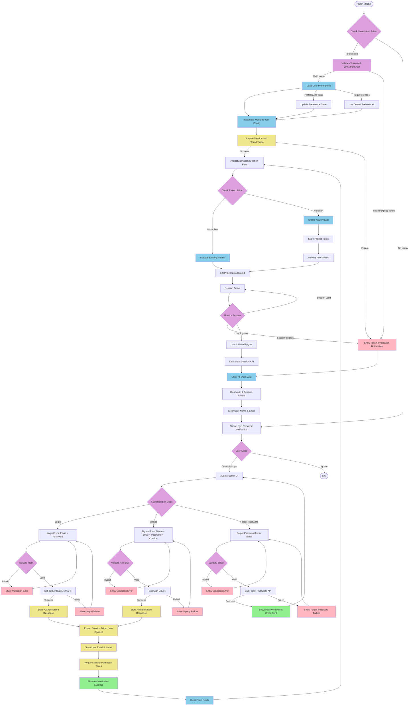

```mermaid
flowchart TD
    Start([Plugin Startup]) --> CheckToken{Check Stored Auth Token}
    
    %% Initial token check
    CheckToken -->|Token exists| ValidateToken[Validate Token with getCurrentUser]
    CheckToken -->|No token| ShowLoginNotification[Show Login Required Notification]
    
    %% Token validation flow
    ValidateToken -->|Valid token| LoadUserPrefs[Load User Preferences]
    ValidateToken -->|Invalid/expired token| TokenInvalid[Show Token Invalidation Notification]
    
    %% User preferences and session setup
    LoadUserPrefs --> InstantiateModules[Instantiate Modules from Config]
    InstantiateModules --> AcquireSession[Acquire Session with Stored Token]
    AcquireSession -->|Success| ProjectFlow[Project Activation/Creation Flow]
    AcquireSession -->|Failure| TokenInvalid
    
    %% Project flow
    ProjectFlow --> CheckProjectToken{Check Project Token}
    CheckProjectToken -->|Has token| ActivateProject[Activate Existing Project]
    CheckProjectToken -->|No token| CreateProject[Create New Project]
    
    ActivateProject --> SetProjectActivated[Set Project as Activated]
    CreateProject --> StoreProjectToken[Store Project Token]
    StoreProjectToken --> ActivateNewProject[Activate New Project]
    ActivateNewProject --> SetProjectActivated
    
    %% Token invalidation flow
    TokenInvalid --> ClearUserData[Clear All User Data]
    ClearUserData --> ClearTokens[Clear Auth & Session Tokens]
    ClearTokens --> ClearUserInfo[Clear User Name & Email]
    ClearUserInfo --> ShowLoginNotification
    
    %% Authentication UI flow
    ShowLoginNotification --> UserAction{User Action}
    UserAction -->|Open Settings| AuthUI[Authentication UI]
    UserAction -->|Ignore| End([End])
    
    %% Authentication modes
    AuthUI --> SelectMode{Authentication Mode}
    SelectMode -->|Login| LoginForm[Login Form: Email + Password]
    SelectMode -->|Signup| SignupForm[Signup Form: Name + Email + Password + Confirm]
    SelectMode -->|Forgot Password| ForgotForm[Forgot Password Form: Email]
    
    %% Login flow
    LoginForm --> ValidateLoginInput{Validate Input}
    ValidateLoginInput -->|Invalid| ShowLoginError[Show Validation Error]
    ValidateLoginInput -->|Valid| CallLogin[Call authenticateUser API]
    
    CallLogin -->|Success| StoreAuthResponse[Store Authentication Response]
    CallLogin -->|Failed| ShowLoginFailure[Show Login Failure]
    
    %% Signup flow
    SignupForm --> ValidateSignupInput{Validate All Fields}
    ValidateSignupInput -->|Invalid| ShowSignupError[Show Validation Error]
    ValidateSignupInput -->|Valid| CallSignup[Call Sign Up API]
    
    CallSignup -->|Success| StoreSignupResponse[Store Authentication Response]
    CallSignup -->|Failed| ShowSignupFailure[Show Signup Failure]
    
    %% Forgot password flow
    ForgotForm --> ValidateForgotInput{Validate Email}
    ValidateForgotInput -->|Invalid| ShowForgotError[Show Validation Error]
    ValidateForgotInput -->|Valid| CallForgotPassword[Call Forgot Password API]
    
    CallForgotPassword -->|Success| ShowForgotSuccess[Show Password Reset Email Sent]
    CallForgotPassword -->|Failed| ShowForgotFailure[Show Forgot Password Failure]
    
    %% Success flows
    StoreAuthResponse --> ExtractSessionToken[Extract Session Token from Cookies]
    StoreSignupResponse --> ExtractSessionToken
    
    ExtractSessionToken --> StoreUserData[Store User Email & Name]
    StoreUserData --> AcquireNewSession[Acquire Session with New Token]
    AcquireNewSession --> ShowAuthSuccess[Show Authentication Success]
    ShowAuthSuccess --> ClearFormFields[Clear Form Fields]
    ClearFormFields --> ProjectFlow
    
    %% Error flows
    ShowLoginError --> LoginForm
    ShowSignupError --> SignupForm
    ShowForgotError --> ForgotForm
    ShowLoginFailure --> LoginForm
    ShowSignupFailure --> SignupForm
    ShowForgotFailure --> ForgotForm
    ShowForgotSuccess --> AuthUI
    
    %% Session management
    SetProjectActivated --> SessionActive[Session Active]
    SessionActive --> MonitorSession{Monitor Session}
    MonitorSession -->|Session expires| TokenInvalid
    MonitorSession -->|Session valid| SessionActive
    MonitorSession -->|User logs out| UserLogout[User Initiated Logout]
    
    %% Logout flow
    UserLogout --> DeactivateSession[Deactivate Session API]
    DeactivateSession --> ClearUserData
    
    %% Configuration updates
    LoadUserPrefs -->|Preferences exist| UpdatePrefState[Update Preference State]
    LoadUserPrefs -->|No preferences| DefaultPrefState[Use Default Preferences]
    UpdatePrefState --> InstantiateModules
    DefaultPrefState --> InstantiateModules
    
    %% End states
    End
    SessionActive
    
    %% Styling
    classDef success fill:#90EE90
    classDef error fill:#FFB6C1
    classDef process fill:#87CEEB
    classDef decision fill:#DDA0DD
    classDef storage fill:#F0E68C
    
    class StoreAuthResponse,StoreSignupResponse,StoreUserData,ExtractSessionToken,AcquireSession,AcquireNewSession storage
    class ShowAuthSuccess,ShowForgotSuccess success
    class ShowLoginError,ShowSignupError,ShowForgotError,ShowLoginFailure,ShowSignupFailure,ShowForgotFailure,TokenInvalid error
    class LoadUserPrefs,InstantiateModules,ActivateProject,CreateProject,ClearUserData,ClearFormFields process
    class CheckToken,ValidateToken,CheckProjectToken,UserAction,SelectMode,ValidateLoginInput,ValidateSignupInput,ValidateForgotInput,MonitorSession decision
```